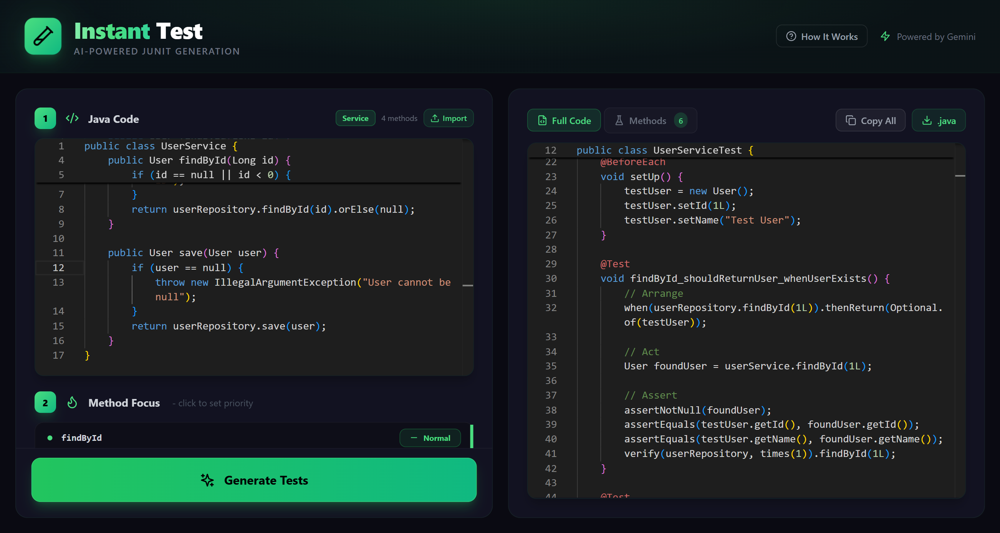

# InstantTest — AI-Powered JUnit Test Generator

A web application that generates JUnit 5 tests from Java source code using Google's Gemini API.



## Features

- **Smart Test Generation**: Analyzes code structure and business logic to produce meaningful tests.
- **Edge Case Coverage**: Automatically covers nulls, empty collections, boundary values, exceptions, and concurrency scenarios.
- **Context-Aware**: Add custom notes to guide test generation toward your specific requirements.
- **Method-Level Control**: Select individual methods and set priority levels for edge case categories.
- **POM Analysis**: Parses your `pom.xml` to align generated tests with your existing project dependencies.
- **Modern Editor**: Split-screen interface powered by Monaco Editor.
- **Export Options**: Copy to clipboard or download as a `.java` file.

## Prerequisites

- Node.js 18+
- A Gemini API key from [Google AI Studio](https://aistudio.google.com)

## Setup

### Backend

```bash
cd backend
npm install
```

Create a `.env` file in the `backend/` directory:

```env
GEMINI_API_KEY=your_api_key_here
PORT=3000
```

Start the server:

```bash
npm start
```

The backend runs on `http://localhost:3000`.

For development with auto-reload:

```bash
npm run dev
```

### Frontend

```bash
cd frontend
npm install
npm run dev
```

The UI is accessible at `http://localhost:5173`.

## Project Structure

```
InstantTest/
├── backend/
│   ├── server.js              # Express server entry point
│   ├── routes/
│   │   └── generate.js        # API endpoint for test generation
│   └── services/
│       ├── geminiService.js   # Gemini API integration and retry logic
│       └── promptBuilder.js   # Prompt construction from source code
├── frontend/
│   └── src/
│       ├── components/        # UI components (editor, selectors, output)
│       ├── utils/
│       │   ├── javaParser.js  # Extracts methods from Java source
│       │   └── pomParser.js   # Parses pom.xml dependencies
│       ├── App.jsx            # Root component and application state
│       └── main.jsx           # Frontend entry point
└── README.md
```

## API Reference

### `POST /api/generate`

Generates a complete JUnit 5 test class from the provided Java source code.

**Request body:**

| Field | Type | Required | Description |
| :--- | :--- | :--- | :--- |
| `code` | String | Yes | Java source code to analyze (max 50,000 chars) |
| `notes` | String | No | Business logic notes or method-specific instructions |
| `casePriorities` | Object | No | Priority levels for edge case categories |
| `pomInfo` | Object | No | Parsed dependency metadata from `pom.xml` |

**Response:**

```json
{
  "success": true,
  "testCode": "import org.junit.jupiter.api.Test;\n...",
  "metadata": {
    "generatedAt": "2026-02-13T13:47:00Z",
    "model": "gemini-2.0-flash"
  }
}
```

## Security

- API keys are stored in environment variables and never exposed to the client.
- Source code input is capped at 50,000 characters.
- Automated backoff and retry logic handles API rate limit (429) responses.
- CORS is configured for local development.

## Tech Stack

**Backend:** Node.js, Express, `@google/generative-ai`, dotenv

**Frontend:** React 18, Vite, TailwindCSS, Monaco Editor, Axios, Lucide React

## License

MIT
